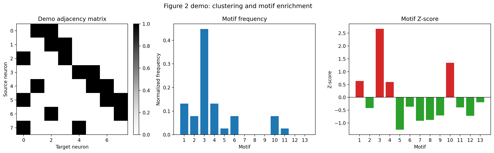

# Figure 2: Brain Clustering and Heatmap

This folder contains the current Figure 2 motif-analysis utilities plus a one-click demo runner.

Files:

- `fig2_core_clustering_heatmap.py`: core motif counting, motif frequency, and motif Z-score functions.
- `run_figure_2.py`: one-click script that generates a compact Figure 2 style result from a bundled demo adjacency matrix.
- `results/`: generated outputs.

Run from the repository root:

```bash
python figure_02_brain_clustering_heatmap/run_figure_2.py
```

Generated outputs:

- `figure_02_brain_clustering_heatmap/results/figure_2_demo.png`
- `figure_02_brain_clustering_heatmap/results/motif_statistics.csv`

Preview:


