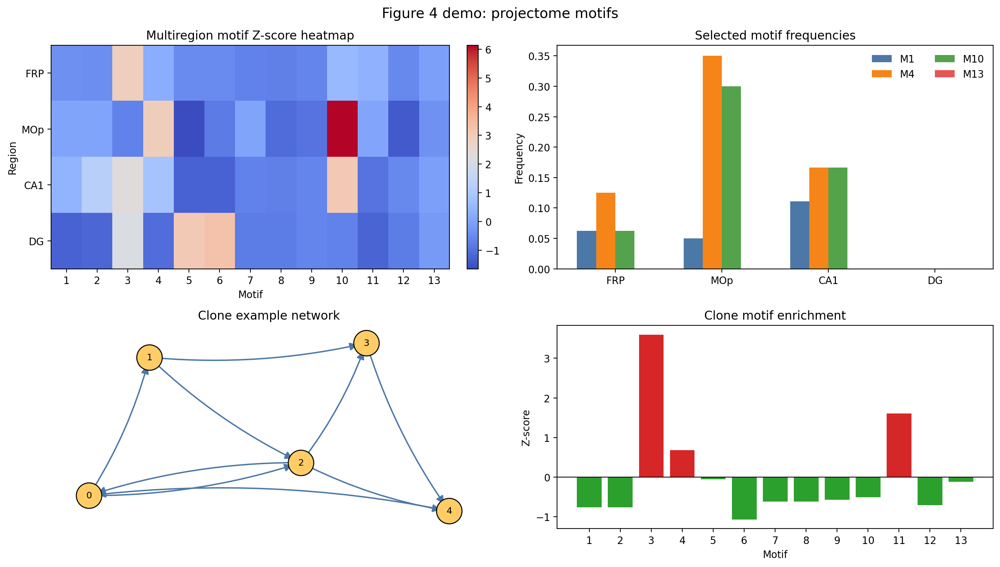

# Figure 4: Projectome Motif Analyses

This folder keeps the current full Figure 4 analysis scripts and adds a one-click demo entry point.

Files:

- `run_figure_4.py`: one-click script that generates a compact Figure 4 style summary figure from bundled demo data.
- `run_multiregion_motif.py`: current exported full-data multiregion analysis script.
- `run_clone_motif.py`: current exported full-data clone analysis script.
- `run_heatmap_analysis.py`: current exported full-data heatmap analysis script.
- `results/`: generated outputs from the one-click runner.

Run from the repository root:

```bash
python figure_04_projectome_motifs/run_figure_4.py
```

Generated outputs:

- `figure_04_projectome_motifs/results/figure_4_demo.png`
- `figure_04_projectome_motifs/results/figure_4_summary.csv`

Notes:

- The one-click runner is designed to be stable and self-contained.
- The three large exported scripts remain in this folder for the current full Figure 4 workflow when the original raw projectome data are available locally.

Preview:


