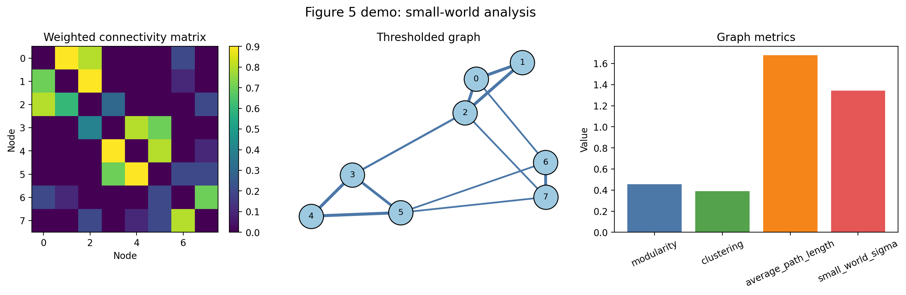

# Figure 5: Small-World Analysis

This folder contains the current Figure 5 graph-metric utilities plus a one-click demo runner.

Files:

- `fig5_core_small_world.py`: core small-world metric functions.
- `run_figure_5.py`: one-click script that generates a compact Figure 5 style result from a bundled weighted graph.
- `results/`: generated outputs.

Run from the repository root:

```bash
python figure_05_small_world/run_figure_5.py
```

Generated outputs:

- `figure_05_small_world/results/figure_5_demo.png`
- `figure_05_small_world/results/graph_metrics.json`

Preview:


